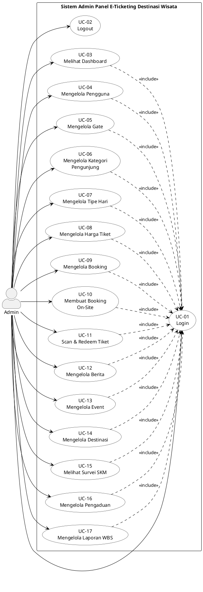

# Use Case Diagram - Sistem Admin Panel E-Ticketing Destinasi Wisata

## 1. Identifikasi Aktor

| No | Aktor | Deskripsi |
|----|-------|-----------|
| 1 | **Admin** | Pengguna yang memiliki hak akses penuh untuk mengelola sistem admin panel e-ticketing destinasi wisata, termasuk manajemen data master, booking, konten, dan survei. |

---

## 2. Daftar Use Case

| No | Use Case ID | Nama Use Case | Deskripsi |
|----|-------------|---------------|-----------|
| 1 | UC-01 | Login | Admin melakukan autentikasi untuk masuk ke sistem |
| 2 | UC-02 | Logout | Admin keluar dari sistem dan mengakhiri sesi |
| 3 | UC-03 | Melihat Dashboard | Admin melihat ringkasan statistik booking, pendapatan, dan data analitik |
| 4 | UC-04 | Mengelola Pengguna | Admin melakukan CRUD (Create, Read, Update, Delete) data pengguna |
| 5 | UC-05 | Mengelola Gate | Admin melakukan CRUD data gate/pintu masuk destinasi |
| 6 | UC-06 | Mengelola Kategori Pengunjung | Admin melakukan CRUD data kategori pengunjung (Lokal, Mancanegara) |
| 7 | UC-07 | Mengelola Tipe Hari | Admin melakukan CRUD data tipe hari (Weekday, Weekend, Hari Libur) |
| 8 | UC-08 | Mengelola Harga Tiket | Admin melakukan CRUD harga tiket berdasarkan kombinasi gate, kategori, dan tipe hari |
| 9 | UC-09 | Mengelola Booking | Admin melihat, mencari, dan memfilter data booking pengunjung |
| 10 | UC-10 | Membuat Booking On-Site | Admin membuat booking untuk pengunjung yang datang langsung ke lokasi |
| 11 | UC-11 | Scan & Redeem Tiket | Admin memindai QR code tiket dan melakukan validasi serta redeem tiket |
| 12 | UC-12 | Mengelola Berita | Admin melakukan CRUD konten berita destinasi wisata |
| 13 | UC-13 | Mengelola Event | Admin melakukan CRUD data event/acara di destinasi wisata |
| 14 | UC-14 | Mengelola Destinasi | Admin melakukan CRUD informasi destinasi wisata |
| 15 | UC-15 | Melihat Survei SKM | Admin melihat hasil dan analitik Survei Kepuasan Masyarakat |
| 16 | UC-16 | Mengelola Pengaduan | Admin melihat dan merespon pengaduan dari masyarakat |
| 17 | UC-17 | Mengelola Laporan WBS | Admin melihat dan menindaklanjuti laporan Whistleblowing System |

---

## 3. Use Case Diagram

---

## 4. Deskripsi Detail Use Case

### UC-01: Login

| Atribut | Deskripsi |
|---------|-----------|
| **Use Case ID** | UC-01 |
| **Nama** | Login |
| **Aktor** | Admin |
| **Deskripsi** | Admin melakukan autentikasi untuk mengakses sistem |
| **Precondition** | Admin memiliki akun terdaftar dengan role admin |
| **Main Flow** | 1. Admin membuka halaman login 2. Admin memasukkan email dan password 3. Admin menekan tombol "Login" 4. Sistem memvalidasi kredensial 5. Sistem menyimpan token dan mengarahkan ke Dashboard |
| **Alternative Flow** | 4a. Kredensial salah → tampilkan pesan error 4b. Role bukan admin → tolak akses |
| **Postcondition** | Admin berhasil masuk ke sistem |

---

### UC-02: Logout

| Atribut | Deskripsi |
|---------|-----------|
| **Use Case ID** | UC-02 |
| **Nama** | Logout |
| **Aktor** | Admin |
| **Deskripsi** | Admin keluar dari sistem |
| **Precondition** | Admin sudah login |
| **Main Flow** | 1. Admin menekan tombol Logout 2. Sistem menghapus token 3. Sistem mengarahkan ke halaman login |
| **Postcondition** | Sesi admin berakhir |

---

### UC-03: Melihat Dashboard

| Atribut | Deskripsi |
|---------|-----------|
| **Use Case ID** | UC-03 |
| **Nama** | Melihat Dashboard |
| **Aktor** | Admin |
| **Deskripsi** | Admin melihat ringkasan statistik dan analitik sistem |
| **Precondition** | Admin sudah login |
| **Main Flow** | 1. Admin mengakses halaman Dashboard 2. Sistem menampilkan:    - Total booking dan pendapatan    - Grafik pendapatan bulanan (online vs offline)    - Distribusi tiket per kategori    - Booking per gate    - Status booking terkini 3. Admin dapat memfilter berdasarkan bulan/tahun/gate |
| **Postcondition** | Statistik dashboard ditampilkan |

---

### UC-04: Mengelola Pengguna

| Atribut | Deskripsi |
|---------|-----------|
| **Use Case ID** | UC-04 |
| **Nama** | Mengelola Pengguna |
| **Aktor** | Admin |
| **Deskripsi** | Admin mengelola data pengguna sistem |
| **Precondition** | Admin sudah login |
| **Main Flow** | 1. Admin mengakses halaman Users 2. Sistem menampilkan daftar pengguna 3. Admin dapat:    - **Tambah**: Input nama, email, password, role → Simpan    - **Edit**: Ubah data pengguna → Simpan    - **Hapus**: Konfirmasi → Hapus pengguna    - **Cari**: Filter berdasarkan nama/email |
| **Postcondition** | Data pengguna berhasil dikelola |

---

### UC-05: Mengelola Gate

| Atribut | Deskripsi |
|---------|-----------|
| **Use Case ID** | UC-05 |
| **Nama** | Mengelola Gate |
| **Aktor** | Admin |
| **Deskripsi** | Admin mengelola data gate/pintu masuk destinasi |
| **Precondition** | Admin sudah login |
| **Main Flow** | 1. Admin mengakses halaman Gates 2. Sistem menampilkan daftar gate 3. Admin dapat:    - **Tambah**: Input nama, deskripsi, lokasi, upload gambar → Simpan    - **Edit**: Ubah data gate → Simpan    - **Hapus**: Konfirmasi → Hapus gate    - **Aktifkan/Nonaktifkan**: Ubah status gate |
| **Postcondition** | Data gate berhasil dikelola |

---

### UC-06: Mengelola Kategori Pengunjung

| Atribut | Deskripsi |
|---------|-----------|
| **Use Case ID** | UC-06 |
| **Nama** | Mengelola Kategori Pengunjung |
| **Aktor** | Admin |
| **Deskripsi** | Admin mengelola kategori pengunjung (Lokal, Mancanegara, dll) |
| **Precondition** | Admin sudah login |
| **Main Flow** | 1. Admin mengakses halaman Visitor Categories 2. Sistem menampilkan daftar kategori 3. Admin dapat melakukan CRUD kategori pengunjung |
| **Postcondition** | Data kategori pengunjung berhasil dikelola |

---

### UC-07: Mengelola Tipe Hari

| Atribut | Deskripsi |
|---------|-----------|
| **Use Case ID** | UC-07 |
| **Nama** | Mengelola Tipe Hari |
| **Aktor** | Admin |
| **Deskripsi** | Admin mengelola tipe hari (Weekday, Weekend, Hari Libur) |
| **Precondition** | Admin sudah login |
| **Main Flow** | 1. Admin mengakses halaman Day Types 2. Sistem menampilkan daftar tipe hari 3. Admin dapat melakukan CRUD tipe hari |
| **Postcondition** | Data tipe hari berhasil dikelola |

---

### UC-08: Mengelola Harga Tiket

| Atribut | Deskripsi |
|---------|-----------|
| **Use Case ID** | UC-08 |
| **Nama** | Mengelola Harga Tiket |
| **Aktor** | Admin |
| **Deskripsi** | Admin mengelola harga tiket berdasarkan kombinasi gate, kategori, dan tipe hari |
| **Precondition** | Admin sudah login, data gate, kategori, dan tipe hari tersedia |
| **Main Flow** | 1. Admin mengakses halaman Ticket Prices 2. Sistem menampilkan daftar harga tiket 3. Admin dapat:    - **Tambah**: Pilih gate, kategori, tipe hari, input harga → Simpan    - **Edit**: Ubah harga → Simpan    - **Hapus**: Konfirmasi → Hapus harga tiket |
| **Postcondition** | Data harga tiket berhasil dikelola |

---

### UC-09: Mengelola Booking

| Atribut | Deskripsi |
|---------|-----------|
| **Use Case ID** | UC-09 |
| **Nama** | Mengelola Booking |
| **Aktor** | Admin |
| **Deskripsi** | Admin melihat dan mengelola data booking pengunjung |
| **Precondition** | Admin sudah login |
| **Main Flow** | 1. Admin mengakses halaman Bookings 2. Sistem menampilkan daftar booking dengan pagination 3. Admin dapat:    - **Cari**: Berdasarkan nama leader, telepon, atau ID booking    - **Filter**: Berdasarkan status, sumber (online/offline), tanggal    - **Lihat Detail**: Klik booking untuk melihat informasi lengkap dan QR code |
| **Postcondition** | Data booking ditampilkan sesuai kriteria |

---

### UC-10: Membuat Booking On-Site

| Atribut | Deskripsi |
|---------|-----------|
| **Use Case ID** | UC-10 |
| **Nama** | Membuat Booking On-Site |
| **Aktor** | Admin |
| **Deskripsi** | Admin membuat booking untuk pengunjung yang datang langsung |
| **Precondition** | Admin sudah login, harga tiket tersedia |
| **Main Flow** | 1. Admin mengakses halaman On-Site Booking 2. Admin input data leader (opsional): nama, kewarganegaraan, nomor ID 3. Admin memilih tiket dan jumlah 4. Sistem menghitung total pembayaran real-time 5. Admin submit booking 6. Sistem generate QR code 7. Sistem menampilkan bukti booking |
| **Postcondition** | Booking on-site berhasil dibuat dengan status "Success" |

---

### UC-11: Scan & Redeem Tiket

| Atribut | Deskripsi |
|---------|-----------|
| **Use Case ID** | UC-11 |
| **Nama** | Scan & Redeem Tiket |
| **Aktor** | Admin |
| **Deskripsi** | Admin memindai QR code tiket untuk validasi dan redeem |
| **Precondition** | Admin sudah login, perangkat memiliki kamera |
| **Main Flow** | 1. Admin mengakses halaman QR Scanner 2. Sistem mengaktifkan kamera 3. Admin scan QR code tiket 4. Sistem menampilkan info tiket dan status validasi 5. Jika valid, admin klik "Redeem" 6. Sistem mengubah status tiket menjadi "Used" |
| **Alternative Flow** | 4a. Tiket expired → tampilkan pesan "Tiket Kadaluarsa" 4b. Tiket sudah digunakan → tampilkan pesan "Tiket Sudah Digunakan" |
| **Postcondition** | Tiket berhasil di-redeem |

---

### UC-12: Mengelola Berita

| Atribut | Deskripsi |
|---------|-----------|
| **Use Case ID** | UC-12 |
| **Nama** | Mengelola Berita |
| **Aktor** | Admin |
| **Deskripsi** | Admin mengelola konten berita destinasi wisata |
| **Precondition** | Admin sudah login |
| **Main Flow** | 1. Admin mengakses halaman News 2. Sistem menampilkan daftar berita 3. Admin dapat:    - **Tambah**: Input judul, konten, upload gambar, status → Simpan    - **Edit**: Ubah berita → Simpan    - **Hapus**: Konfirmasi → Hapus berita    - **Publikasi**: Ubah status publikasi |
| **Postcondition** | Data berita berhasil dikelola |

---

### UC-13: Mengelola Event

| Atribut | Deskripsi |
|---------|-----------|
| **Use Case ID** | UC-13 |
| **Nama** | Mengelola Event |
| **Aktor** | Admin |
| **Deskripsi** | Admin mengelola data event/acara di destinasi |
| **Precondition** | Admin sudah login |
| **Main Flow** | 1. Admin mengakses halaman Events 2. Sistem menampilkan daftar event 3. Admin dapat:    - **Tambah**: Input judul, konten, tanggal, lokasi, upload gambar → Simpan    - **Edit**: Ubah event → Simpan    - **Hapus**: Konfirmasi → Hapus event |
| **Postcondition** | Data event berhasil dikelola |

---

### UC-14: Mengelola Destinasi

| Atribut | Deskripsi |
|---------|-----------|
| **Use Case ID** | UC-14 |
| **Nama** | Mengelola Destinasi |
| **Aktor** | Admin |
| **Deskripsi** | Admin mengelola informasi destinasi wisata |
| **Precondition** | Admin sudah login |
| **Main Flow** | 1. Admin mengakses halaman Destinations 2. Sistem menampilkan daftar destinasi 3. Admin dapat:    - **Tambah**: Input nama, deskripsi, fitur, fasilitas, pilih gate, upload gambar → Simpan    - **Edit**: Ubah destinasi → Simpan    - **Hapus**: Konfirmasi → Hapus destinasi |
| **Postcondition** | Data destinasi berhasil dikelola |

---

### UC-15: Melihat Survei SKM

| Atribut | Deskripsi |
|---------|-----------|
| **Use Case ID** | UC-15 |
| **Nama** | Melihat Survei SKM |
| **Aktor** | Admin |
| **Deskripsi** | Admin melihat hasil Survei Kepuasan Masyarakat |
| **Precondition** | Admin sudah login |
| **Main Flow** | 1. Admin mengakses halaman SKM 2. Sistem menampilkan:    - Skor IKM (Indeks Kepuasan Masyarakat)    - Total responden    - Dimensi terbaik dan terendah    - Grafik distribusi (pendidikan, gender, usia)    - Tren survei harian 3. Admin dapat filter berdasarkan periode 4. Admin dapat export data ke file |
| **Postcondition** | Data survei SKM ditampilkan |

---

### UC-16: Mengelola Pengaduan

| Atribut | Deskripsi |
|---------|-----------|
| **Use Case ID** | UC-16 |
| **Nama** | Mengelola Pengaduan |
| **Aktor** | Admin |
| **Deskripsi** | Admin mengelola pengaduan dari masyarakat |
| **Precondition** | Admin sudah login |
| **Main Flow** | 1. Admin mengakses halaman Pengaduan 2. Sistem menampilkan daftar pengaduan dan analitik 3. Admin dapat:    - **Lihat Detail**: Melihat informasi lengkap pengaduan    - **Respon**: Memberikan tanggapan terhadap pengaduan    - **Ubah Status**: Mengubah status (Pending, In Progress, Resolved, Rejected)    - **Hapus**: Menghapus pengaduan |
| **Postcondition** | Pengaduan berhasil dikelola |

---

### UC-17: Mengelola Laporan WBS

| Atribut | Deskripsi |
|---------|-----------|
| **Use Case ID** | UC-17 |
| **Nama** | Mengelola Laporan WBS |
| **Aktor** | Admin |
| **Deskripsi** | Admin mengelola laporan Whistleblowing System |
| **Precondition** | Admin sudah login |
| **Main Flow** | 1. Admin mengakses halaman WBS 2. Sistem menampilkan daftar laporan dan analitik 3. Admin dapat:    - **Lihat Detail**: Melihat informasi lengkap (5W1H, bukti)    - **Ubah Status**: Mengubah status laporan    - **Catatan Internal**: Menambahkan catatan untuk penanganan    - **Hapus**: Menghapus laporan |
| **Postcondition** | Laporan WBS berhasil dikelola |

---

## 5. Matriks Use Case vs Halaman Sistem

| Use Case | Halaman |
|----------|---------|
| UC-01 Login | `/login` |
| UC-02 Logout | - |
| UC-03 Melihat Dashboard | `/` |
| UC-04 Mengelola Pengguna | `/users` |
| UC-05 Mengelola Gate | `/gates` |
| UC-06 Mengelola Kategori Pengunjung | `/visitor-categories` |
| UC-07 Mengelola Tipe Hari | `/day-types` |
| UC-08 Mengelola Harga Tiket | `/ticket-prices` |
| UC-09 Mengelola Booking | `/bookings` |
| UC-10 Membuat Booking On-Site | `/onsite-booking` |
| UC-11 Scan & Redeem Tiket | `/qr-scanner` |
| UC-12 Mengelola Berita | `/news` |
| UC-13 Mengelola Event | `/events` |
| UC-14 Mengelola Destinasi | `/destinations` |
| UC-15 Melihat Survei SKM | `/skm` |
| UC-16 Mengelola Pengaduan | `/pengaduan` |
| UC-17 Mengelola Laporan WBS | `/wbs` |

---

*Dokumen Use Case - Sistem Admin Panel E-Ticketing Destinasi Wisata*
